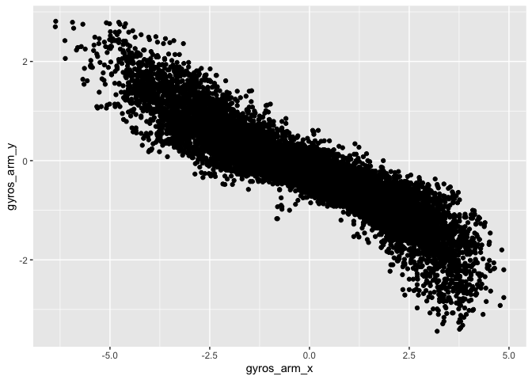
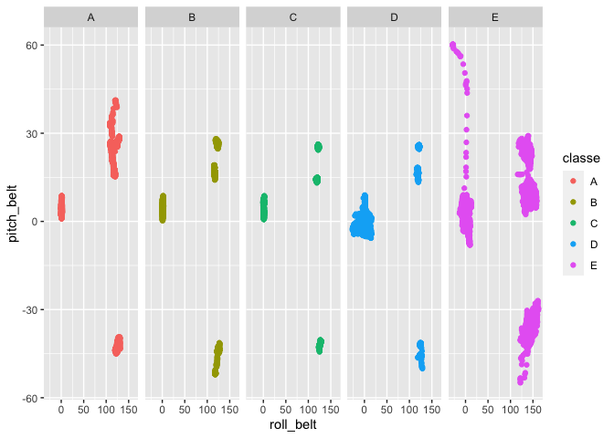
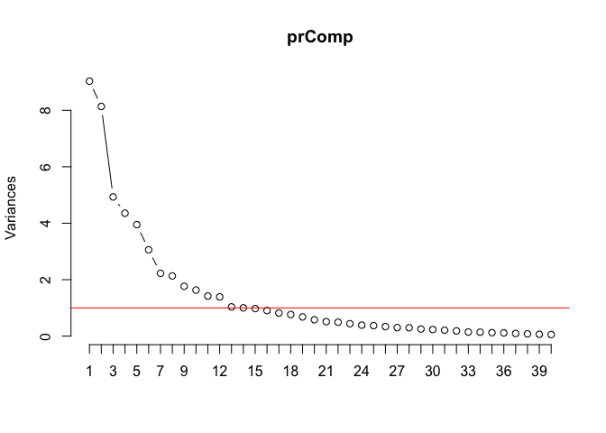

## Executive Summary
This investigation is based on a study by Velloso et al. (2013). This research team quantified many features using accelerometers placed on the belt, forearm, arm, and dumbbell of six participants while performing exercises and classified them into one of five categories (i.e., classe values). These data had a training set (19,216 observations) and a test set (20 observations). The training set was cleaned and variables with excessive missingness were droppped before subdividing these data into training and probe datasets. Patterns of the training data were explored graphically and its dimensionality was reduced using PCA. Four machine learning models were fitted to the training data. The two models with the greatest predictive ability, a random forest model and a bagging model, were evaluated on the probe dataset. The random forest model was more accurate on this dataset and thus was selelcted to predict the classe values of the test data set, which it did at 95% accuracy (or 5% error). 

## 1: Load Packages
The R packages used in this analysis were loaded.

```r
library("caret")
library("tidyverse")
library("lubridate")
library("randomForest")
```

## 2: Get Data 
The working directory was set, and the training and test data sets were downloaded.

```r
fileUrl<-"https://d396qusza40orc.cloudfront.net/predmachlearn/pml-training.csv"
download.file(fileUrl,destfile="/Users/keithpost/Documents/Coursera/Data Science Specialization/8-Practical Machine Learning/exercise_classification/data/traindata.csv",method="curl")
fileUrl2<-"https://d396qusza40orc.cloudfront.net/predmachlearn/pml-testing.csv"
download.file(fileUrl2,destfile="/Users/keithpost/Documents/Coursera/Data Science Specialization/8-Practical Machine Learning/exercise_classification/data/testdata.csv",method="curl")
```

## 3: Read in and Clean Training Data
The training data were stored into an R data frame and cleaned by removing variables with substantial missingness, re-classifying a variable, and dropping another variable since it reflected row numbers, which do not correspond with rows from the testing data.

```r
training<-read.csv("/Users/keithpost/Documents/Coursera/Data Science Specialization/8-Practical Machine Learning/exercise_classification/data/traindata.csv")
#See dimensions of data frames
dim(training)
```

```
## [1] 19622   160
```

```r
#Trim training data frame
sum(colSums(is.na(training))==19216) #67 variables contain 19216 obs out of 19622 obs with NAs
```

```
## [1] 67
```

```r
training2<-training[,which(colSums(is.na(training))!=19216)] #removes variables with excess missingness and stores into new data frame
training2[1:3,10:14] #notice missing data (not marked as NAs)
```

```
##   yaw_belt total_accel_belt kurtosis_roll_belt kurtosis_picth_belt
## 1    -94.4                3                                       
## 2    -94.4                3                                       
## 3    -94.4                3                                       
##   kurtosis_yaw_belt
## 1                  
## 2                  
## 3
```

```r
training2<-training2 %>% mutate_all(na_if,"") #converts missing data to NAs
fulltrain<-training2[,which(colSums(is.na(training2))!=19216)] #removes variables with excess NAs
sum(is.na(fulltrain)) #0; no remaining variables contain NAs
```

```
## [1] 0
```

One variable was converted to an appropriate date-time format for graphing and analysis. The first column (variable), which represented row numbers, was removed.

```r
#Convert date-time variable to appropriate format
fulltrain$cvtd_timestamp<-strptime(fulltrain$cvtd_timestamp,format="%d/%m/%Y %H:%M")
fulltrain$cvtd_timestamp<-as.numeric(fulltrain$cvtd_timestamp)

#Drop first column (row label)
fulltrain<-fulltrain[,-1]
```

The training data were subset further into a probe data frame, which was used to test the model that was trained on the training data (i.e., the remaining data after subsetting the probe data).

```r
set.seed(34)
inTrain<-createDataPartition(y=fulltrain$classe,p=0.7,list=FALSE)
trainEx<-fulltrain[inTrain,]
probeEx<-fulltrain[-inTrain,]
dim(trainEx) #13737 x 59
```

```
## [1] 13737    59
```

```r
dim(probeEx) #5885 x 59
```

```
## [1] 5885   59
```


## 4: Exploratory Data Analysis
The data were explored using bivariate plots. The first example below indicates concern regarding multicollinearity among predictors. The second figure contains plots that were faceted by classe to address concerns related to overplotting and indicates some potential patterns related to classe.


```r
qplot(gyros_arm_x,gyros_arm_y,data=trainEx)
```

<!-- -->

```r
qplot(roll_belt,pitch_belt,data=trainEx,color=classe,facets=.~classe)
```

<!-- -->

The data were standardized given the heterogeneity in means and variances of the variables, but this had no effect on the patterns.

```r
#Standardize data (not columns 1, 5, or 59)
preObj<-preProcess(trainEx[,-c(1,5,59)],method=c("center","scale"))
trainPreProc<-predict(preObj,trainEx[,-c(1,5,59)])
trainPrepEx<-cbind(trainEx[,c(1,5)],trainPreProc,classe=trainEx[,59])

#Bivariate plot of normalized data
qplot(roll_belt,pitch_belt,data=trainPrepEx,color=classe,facets=.~classe)
```

<!-- -->


## 5: Dimension Reduction using Principal Component Analysis
A principal component analysis was run on the training data to reduce its dimensionality for machine learning models. A scree plot of the principal components was constructed to determine the number of principal components to retain for machine learning.


```r
#using prcomp to understand proportion of variance
prComp<-prcomp(trainEx[,-c(1,5,59)],center=TRUE,scale=TRUE)
screeplot(prComp,npcs=40,type="l") 
abline(h=1,col="red") #scree plot; shows where ev=1; this occurs at 0.81 of cumulative variance explained (14 PCs) 
```

<!-- -->

When using a variance cut-off of 1, which explains roughly 81% of the total variance, 14 principal components are retained. These principal components were then used in preprocessing the training data and applied to the probe data.

```r
#produce training data PCs using preProcess at a cut-off of 0.81 (81% variance)
preProc<-preProcess(trainEx[,-59],method="pca",thresh=.81)
trainPC<-predict(preProc,trainEx[,-59])
trainPC<-cbind(trainPC,classe=trainEx[,59])

#apply the same process to probe data
probePC<-predict(preProc,probeEx[,-59])
```


## 6: Fit Models with Training Data
Four models, using a classification tree, random forest, linear discriminant analysis, and bagging, were fitted on the principal components and categorical variables of the training data and tested to ascertain their accuracies in predicting classe values. 

```r
#Recursive partitioning
modelTree<-train(classe~.,method="rpart",data=trainPC)
confusionMatrix(trainEx$classe,predict(modelTree))$overall[1] #0.4174
```

```
##  Accuracy 
## 0.4174128
```

```r
#Random forest
modelRF<-randomForest(classe~.,data=trainPC)
confusionMatrix(trainEx$classe,predict(modelRF))$overall[1] #0.9656
```

```
## Accuracy 
## 0.966441
```

```r
#Linear discriminant analysis
modelLDA<-train(classe~.,method="lda",data=trainPC)
confusionMatrix(trainEx$classe,predict(modelLDA))$overall[1] #0.5156
```

```
##  Accuracy 
## 0.5156148
```

```r
#Bagging
modelBag<-train(classe~.,data=trainPC,method="treebag")
confusionMatrix(trainEx$classe,predict(modelBag))$overall[1] #0.9998
```

```
##  Accuracy 
## 0.9999272
```
The results indicated that the bagging model had the greatest accuracy in predicting classe values, while the random forest model was slightly poorer.


## 7: Assess Out of Sample Error with Selected Model
The bagging and random forest models were used to predict the classe values of the probe data.

```r
#Random forest
confusionMatrix(probeEx$classe,predict(modelRF,probePC))
```

```
## Confusion Matrix and Statistics
## 
##           Reference
## Prediction    A    B    C    D    E
##          A 1634   15   11    9    5
##          B   26 1083   25    3    2
##          C    6   17  987   16    0
##          D    4    4   33  916    7
##          E    2    8    9   12 1051
## 
## Overall Statistics
##                                           
##                Accuracy : 0.9636          
##                  95% CI : (0.9585, 0.9683)
##     No Information Rate : 0.2841          
##     P-Value [Acc > NIR] : < 2.2e-16       
##                                           
##                   Kappa : 0.954           
##                                           
##  Mcnemar's Test P-Value : 0.001196        
## 
## Statistics by Class:
## 
##                      Class: A Class: B Class: C Class: D Class: E
## Sensitivity            0.9773   0.9610   0.9268   0.9582   0.9869
## Specificity            0.9905   0.9882   0.9919   0.9903   0.9936
## Pos Pred Value         0.9761   0.9508   0.9620   0.9502   0.9713
## Neg Pred Value         0.9910   0.9907   0.9839   0.9919   0.9971
## Prevalence             0.2841   0.1915   0.1810   0.1624   0.1810
## Detection Rate         0.2777   0.1840   0.1677   0.1556   0.1786
## Detection Prevalence   0.2845   0.1935   0.1743   0.1638   0.1839
## Balanced Accuracy      0.9839   0.9746   0.9593   0.9742   0.9902
```

```r
#Bagging
confusionMatrix(probeEx$classe,predict(modelBag,probePC)) 
```

```
## Confusion Matrix and Statistics
## 
##           Reference
## Prediction    A    B    C    D    E
##          A 1602   25   18   20    9
##          B   29 1053   38   10    9
##          C   15   20  965   21    5
##          D   10    7   44  890   13
##          E    7   27   13   18 1017
## 
## Overall Statistics
##                                           
##                Accuracy : 0.9392          
##                  95% CI : (0.9328, 0.9451)
##     No Information Rate : 0.2826          
##     P-Value [Acc > NIR] : < 2.2e-16       
##                                           
##                   Kappa : 0.9231          
##                                           
##  Mcnemar's Test P-Value : 0.0004376       
## 
## Statistics by Class:
## 
##                      Class: A Class: B Class: C Class: D Class: E
## Sensitivity            0.9633   0.9302   0.8952   0.9281   0.9658
## Specificity            0.9829   0.9819   0.9873   0.9850   0.9865
## Pos Pred Value         0.9570   0.9245   0.9405   0.9232   0.9399
## Neg Pred Value         0.9855   0.9834   0.9767   0.9860   0.9925
## Prevalence             0.2826   0.1924   0.1832   0.1630   0.1789
## Detection Rate         0.2722   0.1789   0.1640   0.1512   0.1728
## Detection Prevalence   0.2845   0.1935   0.1743   0.1638   0.1839
## Balanced Accuracy      0.9731   0.9561   0.9412   0.9565   0.9762
```
This indicates that the random forest model was more accurate when tested on a sample other than the data that was used for training models. Further, its out of sample error rate was less than 4% and thus the random forest model was selected for predicting classe values for the test data.


## 8: Read in and Clean Test Data Set
The test data set was read into R and cleaned using the same process as for the training data set.

```r
testing<-read.csv("/Users/keithpost/Documents/Coursera/Data Science Specialization/8-Practical Machine Learning/exercise_classification/data/testdata.csv")

#Trim testing data frame
testing2<-testing[,which(colSums(is.na(testing))!=20)] #remove variables without data and store in new object
testEx<-testing2[,-1] #drop first variable (row numbers)
sum(complete.cases(testEx)) #all rows have complete cases
```

```
## [1] 20
```

```r
sum(colnames(testEx) %in% colnames(trainEx)) #all columns match (except the last one, problem id)
```

```
## [1] 58
```

```r
#Convert date-time variable to appropriate format
testEx$cvtd_timestamp<-strptime(testEx$cvtd_timestamp,format="%d/%m/%Y %H:%M")
testEx$cvtd_timestamp<-as.numeric(testEx$cvtd_timestamp)
```


## 9: PCA on Testing Data
The training principal components were applied to the testing data. 

```r
#Run training PCs on testing data
testPC<-predict(preProc,testEx[,-59])

#Trick to circumvent error when using RF model to predict classe values of testing data
trainPCnew<-trainPC[,-17]
testPC<-rbind(trainPCnew[1,],testPC)
testPC<-testPC[-1,]
rownames(testPC)<-1:20
```


## 10: Predict classe Values of Testing Data
The classe values of the testing data were predicted using the random forest model fitted to the training data.

```r
predict(modelRF,testPC)
```

```
##  1  2  3  4  5  6  7  8  9 10 11 12 13 14 15 16 17 18 19 20 
##  B  A  A  A  A  E  D  B  A  A  B  C  B  A  E  E  A  B  B  B 
## Levels: A B C D E
```
This model was 95% accurate following completion of the quiz. This means that it had an out of sample error rate of 5% when run on the test data.


## 11: Reference
Velloso, E.; Bulling, A.; Gellersen, H.; Ugulino, W.; Fuks, H. Qualitative Activity Recognition of Weight Lifting Exercises. Proceedings of 4th International Conference in Cooperation with SIGCHI (Augmented Human '13) . Stuttgart, Germany: ACM SIGCHI, 2013.


